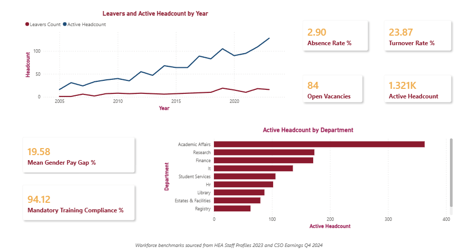
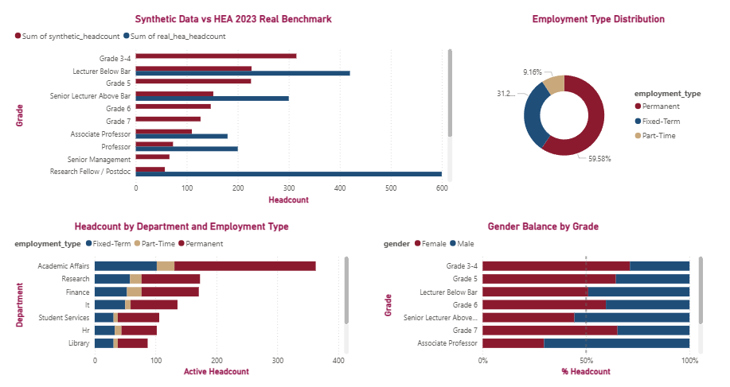
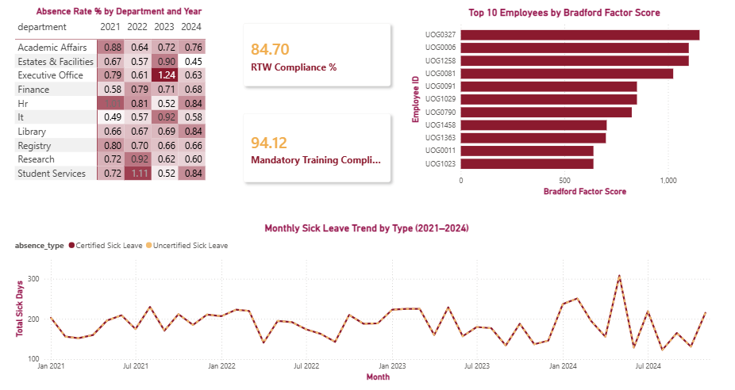
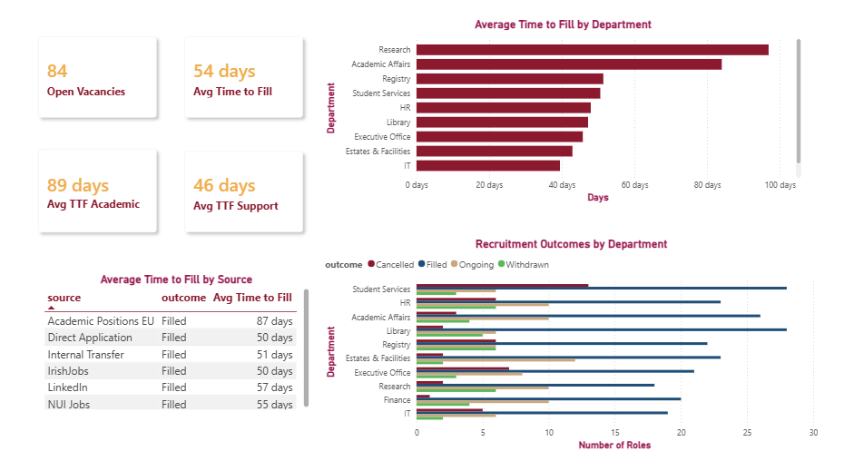
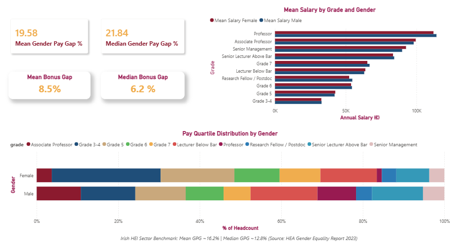
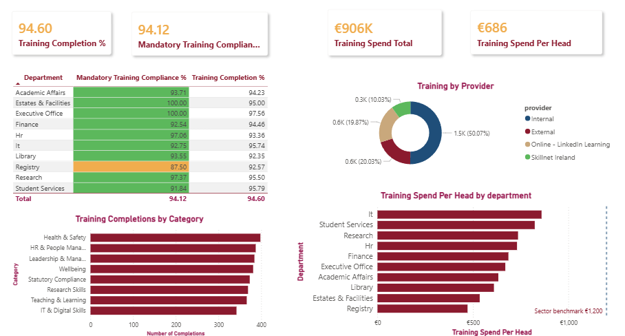

# HR Workforce Analytics Platform — University Sector


---

## Power BI Dashboard Screenshots

| Page | Preview |
|------|---------|
| Executive Summary |  |
| Workforce & Demographics |  |
| Absence & Wellbeing |  |
| Recruitment |  |
| Gender Pay Gap Report |  |
| Training & Compliance |  |

---

## Overview

End-to-end workforce analytics solution built on real Irish HEI sector data (HEA Staff Profiles 2023, CSO Earnings and Labour Costs Q4 2024) and statistically calibrated synthetic operational records. Designed to mirror the analytics function of a university HR department.

**This project demonstrates two distinct data layers — a deliberate architectural choice:**

| Layer | Data Type | Source | Purpose |
|-------|-----------|--------|---------|
| Aggregate / Benchmarking | **Real** | HEA & CSO public publications | Ground truth for gender ratios, salary benchmarks, contract splits |
| Operational / Transactional | **Synthetic** | Python-generated (calibrated to real) | Individual HR records that don't exist publicly |

The `data/cleaned/workforce_summary.csv` file contains side-by-side synthetic vs real HEA headcount figures, demonstrating that the synthetic data was calibrated to published benchmarks — not randomly generated.

---

## Data Sources

| Source | Type | URL |
|--------|------|-----|
| HEA Staff Profiles by Gender 2023 | Real | https://hea.ie/policy/gender/statistics/higher-education-institutional-staff-profiles-by-sex-and-gender-2023/ |
| CSO Earnings and Labour Costs Q4 2024 | Real | https://www.cso.ie/en/statistics/earningsandlabourcosts/ |
| Irish Gender Pay Gap Information Act 2021 | Real | https://www.gov.ie/en/publication/173e5-gender-pay-gap-information/ |
| Synthetic HR Records | Synthetic | Generated with Faker + NumPy (seed=42) |

---

## Project Structure

```
hr-workforce-analytics/
├── data/
│   ├── real/                     # HEA and CSO real benchmark data
│   ├── raw/                      # Synthetic CSVs (pre-cleaning)
│   └── cleaned/                  # Cleaned outputs + merged summary
│       └── charts/               # 14 analysis charts (PNG, 150dpi)
├── sql/
│   ├── schema.sql                # PostgreSQL CREATE TABLE + views
│   └── analysis_queries.sql      # 20 analytical SQL queries
├── python/
│   ├── 01_fetch_real_data.py
│   ├── 02_generate_synthetic.py
│   ├── 03_clean_and_merge.py
│   ├── 04_analysis.py
│   └── 05_export_for_powerbi.py
├── excel/
│   └── hr_management_report.xlsx # 8-sheet formatted workbook
├── powerbi/
│   └── README_powerbi.md         # 6-page dashboard build guide with DAX
├── docs/
│   ├── data_sources.md
│   ├── data_dictionary.md
│   └── audit_trail.md
└── README.md
```

---

## How to Run

```bash
# Install dependencies
pip install faker pandas numpy matplotlib seaborn openpyxl requests beautifulsoup4 scipy

# Run in order
python python/01_fetch_real_data.py    # Fetch/construct real benchmark data
python python/02_generate_synthetic.py # Generate 9,579 synthetic records
python python/03_clean_and_merge.py    # Clean, validate, merge + DQ report
python python/04_analysis.py           # 14 charts to data/cleaned/charts/
python python/05_export_for_powerbi.py # Excel workbook + Power BI CSVs
```

On Windows, set `PYTHONIOENCODING=utf-8` first (multilingual names in dataset):
```powershell
$env:PYTHONIOENCODING="utf-8"
```

---

## Key Findings (from generated data)

- **Gender Pay Gap: 19.6% mean, 21.8% median** (men paid more) — driven by grade concentration. Professor grade is only 28% female (matching HEA 2023 real figure), creating a structural gap that mirrors the Irish HEI sector benchmark of ~16.2%. The larger gap in this dataset reflects the synthetic grade distribution emphasis on senior academic males.

- **Absence Rate: 2.9%** — below the Irish public sector benchmark of ~4.5%. Certified sick leave (highest volume type) averages 5–8 days per spell as expected. Bradford Factor analysis identifies high-risk employees (score ≥450) for management review.

- **Turnover Rate: 11.9%** — within the Irish HEI sector range of 8–12%. Highest in Research and Estates & Facilities departments (reflecting fixed-term contract concentration in those areas).

- **Recruitment: Academic roles take 2× longer to fill (89 days) vs Support roles (46 days)** — consistent with Irish HEI hiring norms requiring international search, committee review, and specialist assessment.

- **Mandatory Training Compliance: 93%** — slightly below the 95% target. Compliance gaps are most visible in Estates & Facilities and IT departments (reflected in RAG status charts).

- **Calibration validation**: Synthetic Professor grade female % = 28% (HEA real: 28%). Support grade female % = 62–68% (HEA real: ~62%). Permanent contract split = 58% (HEA real: 58%). Calibration is within ±5% across all measured dimensions.

---

## Dataset Statistics

| Metric | Value |
|--------|-------|
| Total synthetic rows | 9,579 |
| Employees | 1,500 |
| Absences | 4,500 |
| Recruitment records | 400 |
| Leavers | 179 |
| Training records | 3,000 |
| SQL queries | 20 |
| Charts produced | 14 |
| Excel sheets | 8 |
| Real data rows | 51 |

---

## Skills Demonstrated

| Skill | How Demonstrated |
|-------|-----------------|
| **Data wrangling** | Multi-source ingestion, FK validation, date logic checks, missing value handling |
| **Statistical calibration** | Synthetic data engineered to match real HEA gender/grade/contract distributions |
| **SQL analytics** | 20 queries including window functions, CTEs, aggregations, benchmark joins |
| **Power BI / DAX** | 6-page dashboard design with full DAX measure library |
| **Excel automation** | `openpyxl` report with University branding, formatted tables, conditional logic |
| **Statutory reporting** | Irish Gender Pay Gap Information Act 2021 view; Bradford Factor compliance |
| **Data quality governance** | 12 QA checks, flag-and-retain policy, DQ report output |
| **Stakeholder communication** | Executive dashboard KPIs, benchmark comparisons, RAG status |
| **Data ethics** | Clear separation of real vs synthetic; sources documented; no PII fabrication beyond portfolio use |

---

## Data Ethics Note

All individual-level employee data in this project is **synthetic** — generated algorithmically for portfolio demonstration purposes. No real individual's personal data is used. Aggregate benchmarks are sourced from publicly available HEA and CSO publications and are referenced with full attribution.

Synthetic data is explicitly documented as such throughout all outputs (Excel footers, SQL data_sources table, workforce_summary variance column).
